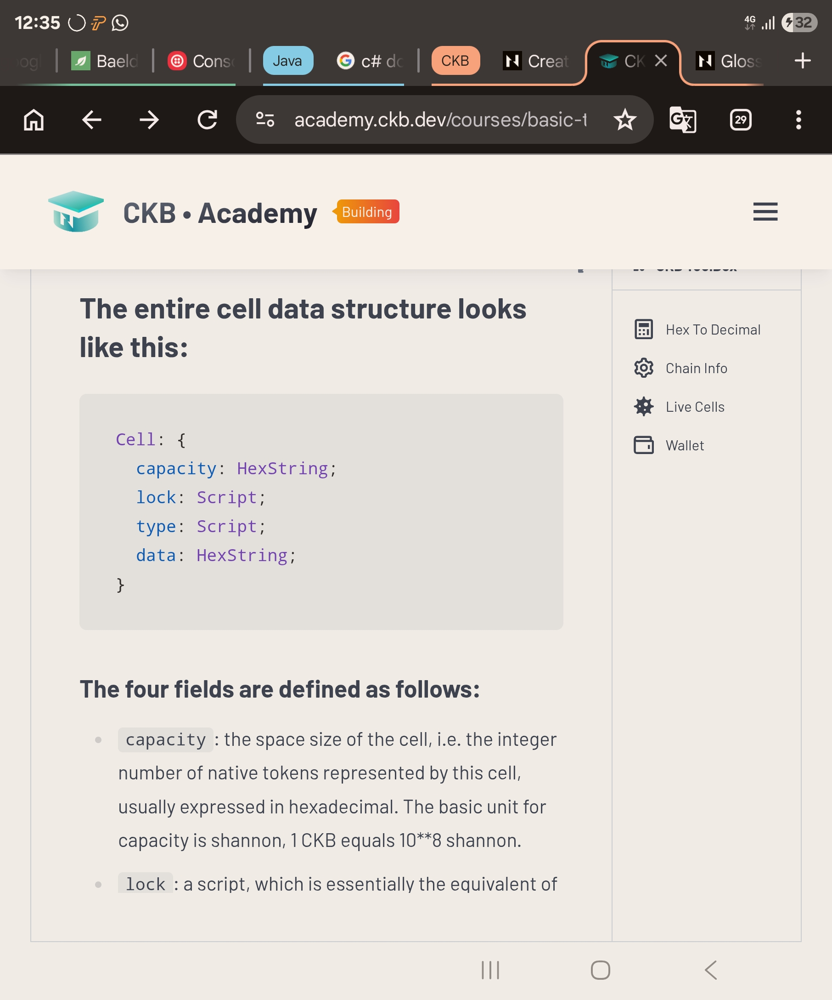
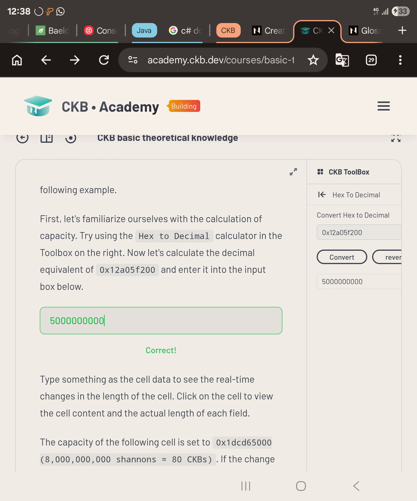
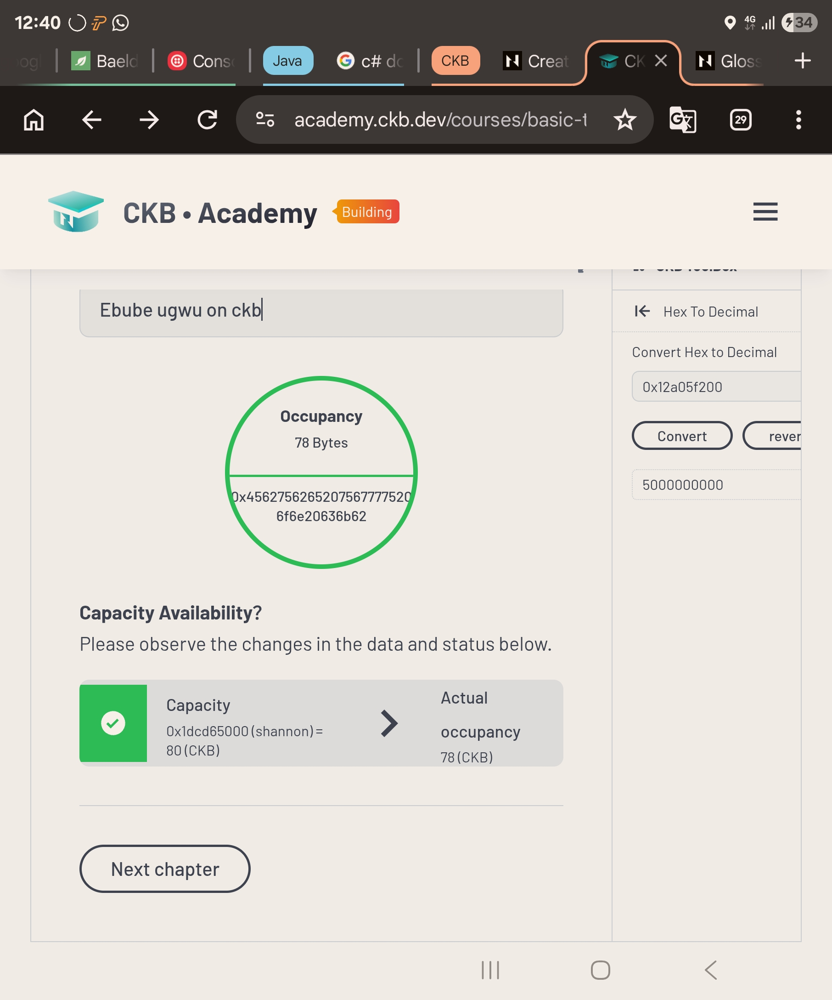
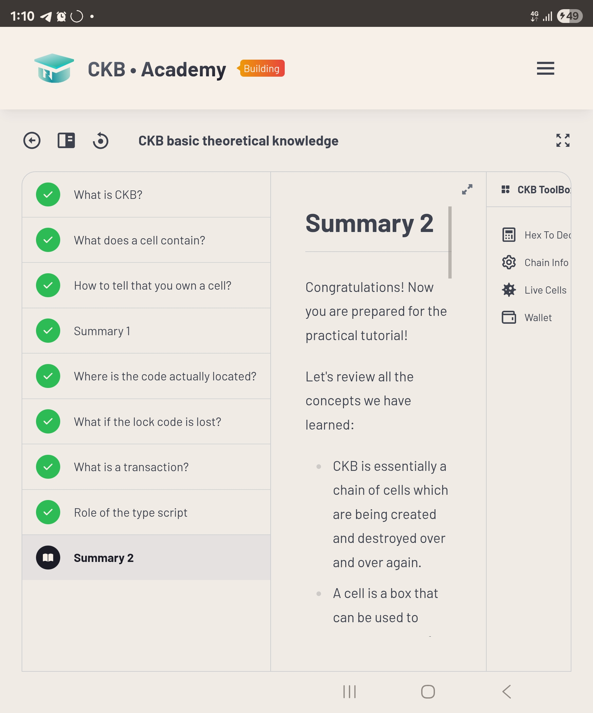
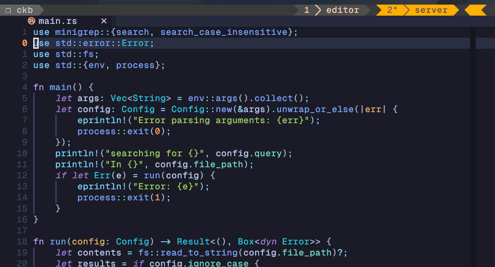

# CKB Builder Track Weekly Report - Week 1

Name: Ebube Ugwu
Week Ending: 01-05-2026

## Courses Completed

- First Lesson - CKB Academy
- Second Lesson - CKB Academy
- Revised Chapter 1 - 12 of the Rust Book and built a minigrep command line tool

### Screenshots

## Key Learnings

- The CKB cell model (which is similar to the UTXO-model used in Bitcoin and other blockchains)

- Use of Lock Scripts (for ownership and Authorization) and Type Scripts (for enfocing rules on how cells can change) in Security

- Script Grouping and Syscalls provided by the CKB VM (virtual Machine)

- Core Rust Concepts (Data types, Ownership and borrowing, pattern matching, modules and crates)

## Practical Progress

- Manually Constructed and sent a transaction to CKB testnet
- Began using CKB CLI tools
- Wrote a basic GREP CLI tool in Rust

## Environment

- CKB CLI tool installed and running

- Cargo, Rust and Node instalaled via Rustup and nvm
