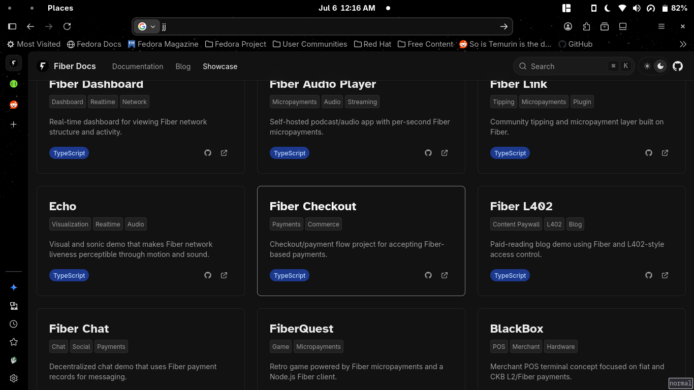

# CKB Builder Track Weekly Report - Week 10

**Name:** Ebube Ugwu  
**Week Ending:** 05-07-2026

## _An Idea is Born💡_

## Fiber Network Infrastructure Hackathon

With the Fiber Network Infrastructure Hackathon officially underway, this week was focused almost entirely on finding a project idea that would both provide real value to the Fiber ecosystem and remain achievable within the hackathon timeline.

Rather than immediately jumping into development, I spent most of the week researching the existing Fiber ecosystem, comparing potential ideas with projects already available in the [Fiber Showcase](https://www.fiber.world/showcase), and identifying infrastructure gaps that had not yet been explored.

The goal wasn't simply to build another application, but to build reusable infrastructure that other developers could benefit from, especially traditional developers like me.

---

## Brainstorming Project Ideas

A considerable amount of time this week was spent evaluating different project ideas before writing much code.

### Fiber Java / Spring Boot SDK

One of the first ideas was to build a Java SDK together with a Spring Boot Starter for Fiber (Since i'm a Java geek😁).

The motivation was simple: although much of the Web3 ecosystem revolves around JavaScript and Rust, many serious backends are still built using Java and Spring Boot. A well-designed SDK would make integrating Fiber into existing backend systems significantly easier.

I even began planning the SDK architecture and discussed how it could eventually be published independently as its own reusable library (Mainly via Springboot Integrations, since it's the most popular JVM backend solution).

---

### Merchant Settlement & Reconciliation Platform

The second major idea focused on merchant infrastructure.

The proposed platform would provide:

- Payment ledger
- Settlement reporting
- Reconciliation
- Refund tracking
- CSV exports
- Webhook notifications

After comparing it with projects already available on the Fiber Showcase, this looked like a promising gap in the ecosystem.

However, after further consideration, I decided that correctly modelling settlement behaviour and merchant accounting while simultaneously learning Fiber internals would introduce unnecessary complexity within the hackathon timeframe.

---

### Fiber Dashboard / Developer Studio

Another idea was to build a developer dashboard similar to Postman or Android Studio for Fiber.

Some of the proposed modules included:

- Node monitoring
- Channel explorer
- Peer explorer
- Payment viewer
- RPC explorer
- Invoice generation
- QR code generation
- Diagnostics tooling

Some basic planning and UI discussions were carried out around this idea before continuing the search for something with a clearer focus.

---

## Comparing Existing Community Projects

One of the most valuable parts of this week was carefully studying projects already built by the community.

Instead of building the first interesting idea that came to mind, I compared every major concept against the projects available on the Fiber Showcase.

This process helped eliminate several ideas that already had similar implementations, particularly around wallet integrations and checkout flows.

Rather than competing with existing work, I wanted to build something that genuinely improved the developer experience and filled an obvious infrastructure gap.

This exercise ended up shaping the final direction of the project.

---

## Final Direction — FiberMan

After several iterations, the project eventually evolved into **Fiber Playground**.

Fiber Playground is an interactive developer console for Fiber Network.

Instead of manually writing JSON-RPC requests using curl, Postman or custom scripts, developers can interact with a Fiber node through a visual interface.

The aim is to lower the learning curve for new Fiber developers while making experimentation and integration significantly easier.

The current MVP is planned to include:

- RPC Explorer
- Invoice Builder
- QR Code Generator
- Payment History
- Copy as cURL
- Copy as Java (powered by the Java SDK)

The Java SDK itself will remain a reusable component that can later be published independently.

Since the hackathon is still ongoing, I don't want to reveal too much about the project publicly just yet. By next week's report the MVP will be complete and ready to demonstrate.

## Sidenote: _Many other ideas were explored before settling on FiberMan, but they were discarded for one or more of the following reasons:_

    - Similar project already existed
    - Too Complex to build giving my experience and the time limit
    - Didn't have a practical usecase
    - I didn't like it

## Another Sidenote: _If you are wondering how i came up with different ideas, it was a mixture of:_

    - Different LLM models (ChatGPT, Claude, Gemini, Deepseek)
    - Reading Nervos Talks for Ideas
    - Asking Peers (Mugiwara/Paschal)
    - Looking at ideas implemented in other blockchain ecosystems
    - Trying whatever came to my mind

---

## Hackathon Progress

For now, implementation has only just begun.

Completed so far:

- Finalized project direction ☑️
- Completed architecture and feature planning ☑️
- Spring Boot project setup ☑️
- Java SDK scaffolding ☑️
- Successfully connected to a Fiber node and tested JSON-RPC communication ☑️

Getting the very first RPC call working was an important milestone, as it validated the overall architecture before moving on to the SDK and user interface.

---

## Key Learnings

- Spending time researching existing community projects before writing code can save significant development effort.
- A good hackathon project should solve a genuine infrastructure problem rather than duplicate existing work.
- Narrowing project scope is often more valuable than continuously adding features.
- Separating reusable libraries (such as the Java SDK) from applications improves long-term maintainability.
- Successfully communicating with a live Fiber node early significantly reduces implementation risk for the rest of the project.

---

## Screenshots

---

## Reference Links

- Fiber Official Site: https://fiber.world
- Fiber Showcase: https://www.fiber.world/showcase
- Fiber GitHub Repository: https://github.com/nervosnetwork/fiber
- Fiber Documentation: https://docs.fiber.world

---

## Week 11

- Complete the Java Fiber SDK
- Build the Spring Boot backend APIs
- Implement the Angular RPC Explorer
- Add Invoice Builder and QR generation
- Finish the MVP and submit the hackathon project 🚀
- Hopefully Finish up the previous non-hackathon related work (i.e Fundraiser Project)
- Finalize My Capstone CKB Project Idea (My 12 weeks of babysitting are almost up🙃)
