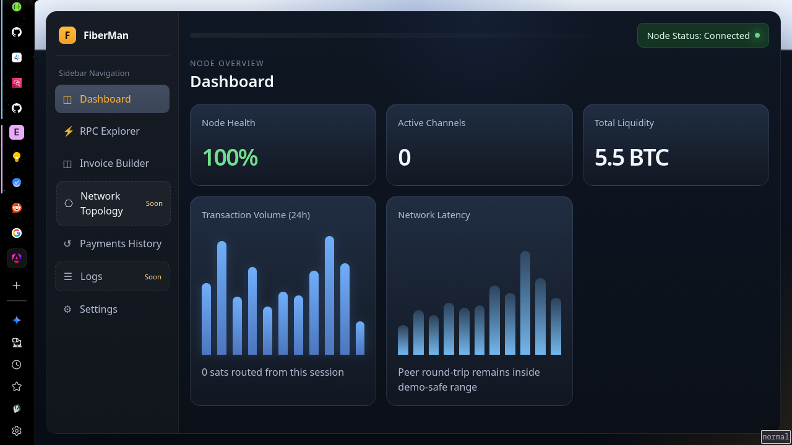
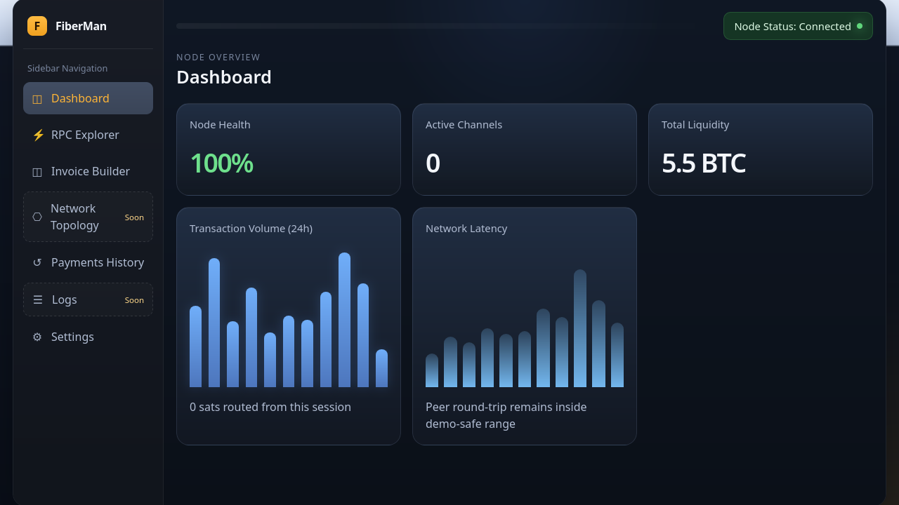
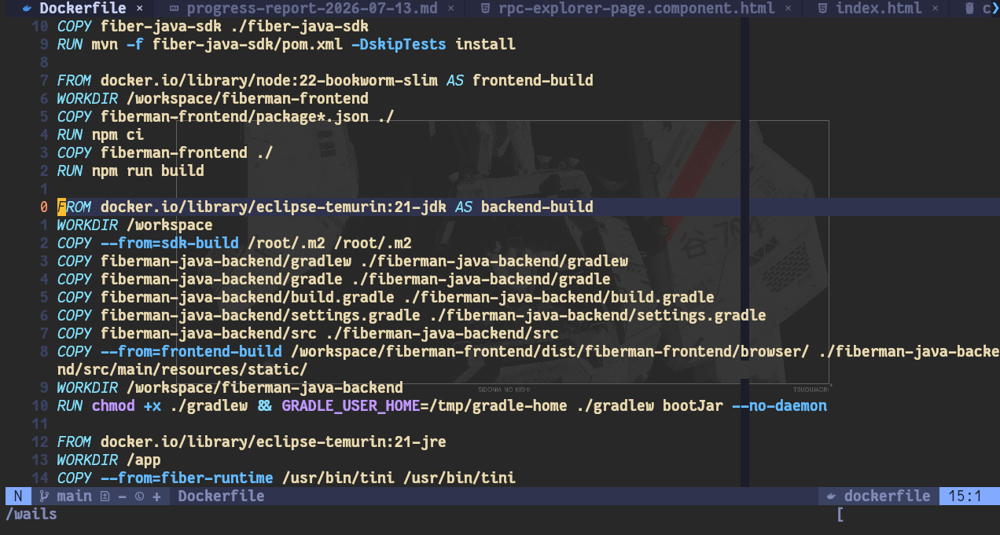
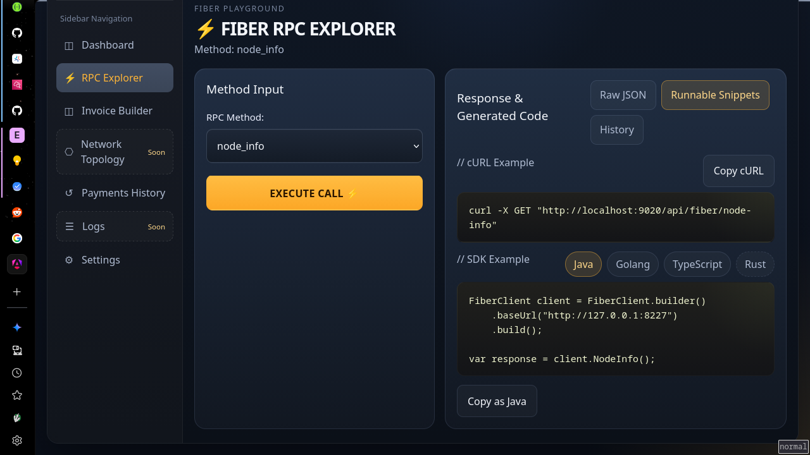

# CKB Builder Track Weekly Report - Week 11

**Name:** Ebube Ugwu  
**Week Ending:** 12-07-2026

## _FiberMan Prototype is built💪_

## Fiber Network Infrastructure Hackathon

This week was almost entirely consumed by implementation.

After spending the previous two weeks studying Fiber, comparing ideas, and narrowing scope, I focused on actually building the hackathon project: **FiberMan**.

The important milestone for this week is that the core project is now done.

What remains before final submission is mostly operational work:

- deployment
- recording the showcase/demo video
- polishing the final submission pack

So this week marks the transition from **"figuring out what to build"** to **"finishing and packaging what has been built."**

---

## What FiberMan Became

The original idea started as a simple Java SDK plus a backend/frontend demo surface for Fiber RPC calls.

By the end of this week, FiberMan had evolved into a much more complete **developer-facing Fiber infrastructure playground**.

The goal of the project is to reduce the gap between:

- "I want to try a Fiber operation"
- "I now understand the request/response shape"
- "I have working code I can reuse in my own application"

### *Basically gives an exploratory testing power to devs building on fiber Network*

Instead of manually testing Fiber JSON-RPC with raw curl commands every time, FiberMan gives developers a visual and reusable workflow for exploring a live Fiber node.

At its core, the project app now supports:

- live Fiber RPC exploration
- invoice generation
- QR code generation
- session-based call history
- generated `curl` commands
- generated Java integration snippets
- generated Go integration snippets

This is exactly the kind of tooling I originally felt was missing while learning the ecosystem.

---

## Main Implementation Work This Week

Most of my time went into moving the project from MVP planning into a working hackathon-ready system.

### Java SDK

Built the plain Java Fiber SDK as a reusable integration layer instead of tightly coupling everything to Spring Boot.

That decision matters because the SDK can still live independently of the demo app and be reused later in other JVM projects.

The SDK handles:

- HTTP transport
- JSON-RPC request/response structure
- method wrappers for common Fiber operations
- error handling around node communication

This became the most validated part of the project and served as the foundation for the initial working MVP.

---

### Java Backend

Implemented the backend that sits between the frontend and the live Fiber node.

The backend became responsible for:

- calling the SDK
- exposing cleaner demo-friendly endpoints
- keeping recent session history
- generating reusable code artifacts from executed actions

A particularly useful addition was the ability to update runtime settings without restarting the app.

That means node URL, auth token, timeout, and other configuration can be changed live, which makes demos and testing much more practical.

---

### Frontend Playground

The frontend now acts as the main interaction layer for FiberMan.

The focus was not just making something that works, but making something that helps a developer learn what Fiber is doing underneath.

The main surfaces implemented are:

- Dashboard
- RPC Explorer
- Invoice Builder
- Network Topology
- Logs
- Payments History
- QR output
- History replay
- generated snippet viewing/copying
- runtime settings UI

This made the project feel much closer to a real developer tool rather than just a hackathon proof of concept.

Some of those screens are more production-ready than others. The RPC Explorer, Settings, Invoice Builder, and History flow are backed by real API calls, while parts of Dashboard, Topology, and Logs currently lean on derived or presentation-oriented data.

### Screenshot

---

### Go SDK, Go Backend, and Desktop Runtime

One of the biggest things I failed to mention is that the project expanded beyond the original Java-only plan.

In addition to the Java path, I also implemented:

- a plain **Go Fiber SDK**
- a **Go backend** designed to preserve the same frontend contract
- a **Wails desktop app** that packages the frontend together with a Go service runtime

This is important because i plan to support sdk for popular programming languages (Java, Rust, golang, Typescript) since the functionality is specific and small enough to be managed easily

It has started evolving into a broader multi-runtime developer tool with:

- Java for JVM developers
- Go for a lighter backend/runtime path
- Wails for desktop packaging without needing something heavier like Electron

That architectural direction gives the project a more credible long-term future beyond the hackathon.

## *The desktop version is necessary as i plan for fiberman to be a desktop app, as that would be the most convenient way to use it, I built a web version primarily for the sake of the hackathon, so the judges could easily see and interact with it, while understanding the main value it provides*

---

### Containerized Demo Packaging

Another important improvement this week was the move toward an all-in-one deployment path. (The standard approach would be to use docker compose, since i need to deploy both fnn, java runtime and the angular frontend, but that would be painful to deploy especially on something that would be meant  to be temporary just to showcase my POC)

The project now includes container-oriented packaging that aims to:

- bundle the app and Fiber runtime together
- reduce setup friction for judges
- make the demo easier to run with Docker, Podman, or compose-based workflows

That matters because good hackathon infrastructure is not only about writing features, but also about making the project easy to launch and evaluate.

---

## Architecture Decisions That Helped

A few design decisions turned out to be especially helpful during implementation:

- Keeping the SDK framework-independent made the project cleaner and more reusable.
- Returning raw or lightly processed JSON avoided wasting time over-modelling Fiber responses too early.
- Generating `curl`, Java, and Go code from the backend ensured the copied examples stayed aligned with real executed requests.
- Using lightweight session history avoided unnecessary database setup during hackathon delivery.
- Adding runtime configuration made the playground much easier to demo against different node setups.
- Preserving the frontend contract while exploring a Go backend made it possible to evolve the runtime without throwing away the UI.
- Exploring Wails created a practical desktop path for developer tooling and node operations use cases.

These choices kept the scope under control while still producing something useful beyond the hackathon.

---

## Current Project Status

As of this report, the main hackathon project is effectively complete from a product/build standpoint.

Completed so far:

- FiberMan project direction finalized ☑️
- Java Fiber SDK implemented ☑️
- Java backend implemented ☑️
- Go Fiber SDK implemented ☑️
- Go backend implemented ☑️
- Wails desktop runtime implemented ☑️
- Frontend playground implemented ☑️
- Live Fiber RPC integration working ☑️
- Invoice generation flow working ☑️
- QR generation working ☑️
- Copy-as-`curl` flow working ☑️
- Copy-as-Java snippet flow working ☑️
- Copy-as-Go snippet flow working ☑️
- Session history working ☑️
- Runtime settings support working ☑️
- Containerized deployment path prepared ☑️

Still remaining:

- Deploy the runnable demo
- Record and upload the showcase video
- Fill in final public submission details

---

## What I Learned

- Hackathon ideas become much stronger when they are grounded in a real pain point you personally felt during implementation (Real world usecases are better than fancy dApps that don't really offer any real value apart from eye candy)
- Building reusable infrastructure is different from building a one-off demo; separation of concerns matters much more (it would give me joy if someone could use any of the sdk to build something no one saw coming)
- Runtime configuration is a huge quality-of-life improvement for developer tools and demos.
- Code generation becomes far more useful when it is derived from actual successful requests, not hand-written templates (Having a GUI is nice).
- Preserving one frontend contract across multiple backend/runtime experiments makes future migration much safer (honestly, and technologies like wails(a golang version of tauri(a rust version of electron)) make these seamless)
- The FiberMan app functions way better as a desktop solution, (the web app is mainly for showcase)
---

## Reference Links

- Fiber Official Site: https://fiber.world
- Fiber Showcase: https://www.fiber.world/showcase
- Fiber GitHub Repository: https://github.com/nervosnetwork/fiber
- Progress Report: `docs/progress-report-2026-07-13.md`
- Submission Draft: `docs/fiber-hackathon-submission.md`

---

## Week 12

### Hackathon
- Deploy FiberMan and verify the hosted demo works reliably
- Record and publish the showcase video
- Finalize the hackathon submission details
- Clean up the project documentation and repo presentation
- Continue stabilizing the Go/Wails path after submission
- Plan a later, more stable release with Rust and TypeScript SDK support
- Resume focus on the remaining CKB Builder track work after the hackathon rush

### CKBTrack
- Finish Capstone fundraiser dApp
- Pick a niche in the nervos system
- Get updates from moderator
- Write tutorial 
- Write on the experience 
