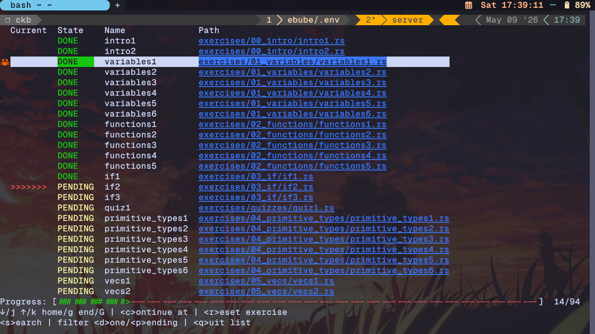
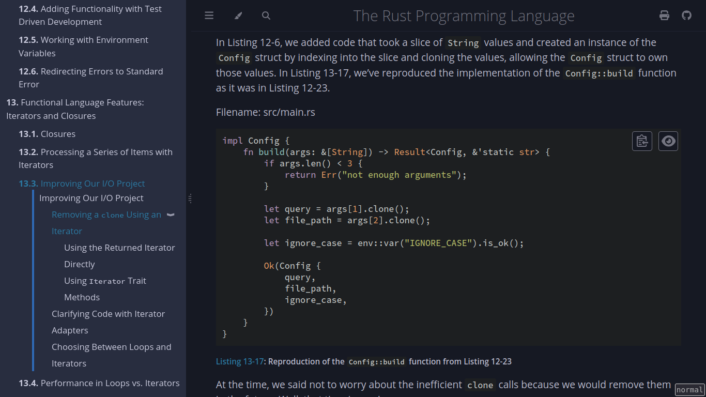
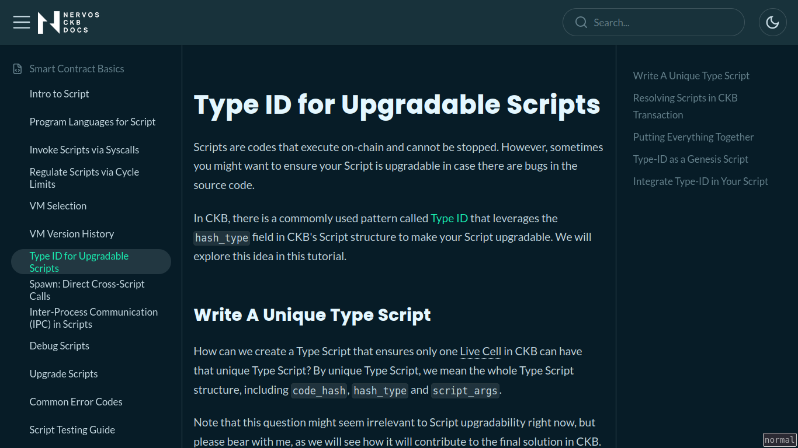

# CKB Builder Track Weekly Report - Week 2

Name: Ebube Ugwu
Week Ending: 08-05-2026

## Courses Completed

- Revised Chapter 13 - 18 of the **Rust Book** and built a I/O tool
    - Iterators and Closures
    - Package management with Cargo
    - Smart Pointers
    - Concurrency with Threads
    - Asynchronous Programming
    - Object Oriented Programming Feature with Traits

- [Introduction to Scripts on Nervos CKB](https://docs.nervos.org/docs/script/type-id)
    - How a script works
    - Types of Scripts
    - Programming Languages used
    - VM Versions and Selecting a VM for your Script
    - Type Scripts
    - Inter-Process Communication in Scripts

- Learn CKB in 45mins by [truthixify](https://github.com/truthixify/learn-ckb-in-45-minutes)
    - **Cells and Scripts:** CKB’s basic units store data and logic as an evolution of the UTXO model.
    * **Transaction Structure:** Transactions function by destroying existing cells to create new ones.
    * **Script Identification:** Scripts are located and triggered via `code_hash`, `hash_type`, and `args`.
    * **NC-Max Consensus:** An optimized Proof-of-Work protocol that maximizes throughput and shortens block times.
    * **Economic Model:** Native tokens represent on-chain storage capacity, implementing a "state rent" system.
    * **User Defined Tokens:** Assets are stored in user-owned cells rather than a single central contract.
    * **CKB-VM Execution:** A flexible RISC-V virtual machine that runs smart contracts written in diverse languages.
    * **Off-Chain/On-Chain Pattern:** Computation is performed off-chain, while the blockchain handles only verification.

### Screenshots

## Key Learnings

- Strengthened Rust fundamentals needed for CKB script development, especially iterators, closures, Cargo package management, smart pointers, threads, async programming, and trait-based object-oriented patterns.

- Learned how CKB scripts work, including the roles of lock scripts and type scripts, how scripts are identified with `code_hash`, `hash_type`, and `args`, and how the VM version affects script execution.

- Understood the CKB cell model as an extension of the UTXO model, where transactions consume existing cells and create new cells that hold capacity, data, and scripts.

- Studied CKB-VM execution and the off-chain/on-chain pattern, where heavy computation happens off-chain while scripts verify proofs, signatures, and state transitions on-chain.

- Learned transaction validation concepts such as witnesses, script groups, dep groups, the `since` field for time locks, and inter-process communication between scripts.

- Reviewed how CKB's economic model ties CKBytes to on-chain storage capacity and how user-defined tokens can be modeled through user-owned cells.

## Practical Progress

- Revised Chapters 13 - 18 of the Rust Book and practiced the concepts by building a Rust I/O command-line tool.

- Wrote a basic GREP CLI tool in Rust

- Worked through the CKB script introduction and documented the main script types, VM selection considerations, and script communication concepts.

- Completed the Learn CKB in 45mins walkthrough and reviewed the first-script workflow using Rust.

- Practiced reasoning about CKB transactions in terms of inputs, outputs, cell deps, witnesses, and script execution.

## Environment

- Rust toolchain and Cargo configured for building CLI tools and preparing for CKB script development.

- Rustup available for managing Rust versions and targets.

- Node environment available through nvm for tooling that may be needed in the CKB development workflow.

- CKB CLI tooling remains available for interacting with testnet and inspecting CKB transactions.

## Extra

- Watched a Nervos conference about scaling cryptocurrencies via state channels, by Patrick McCorry

- Watched a Youtube video giving a nervos CKB walkthrough