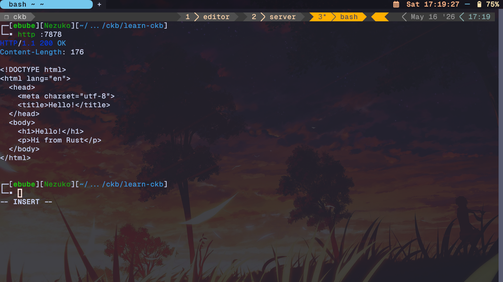
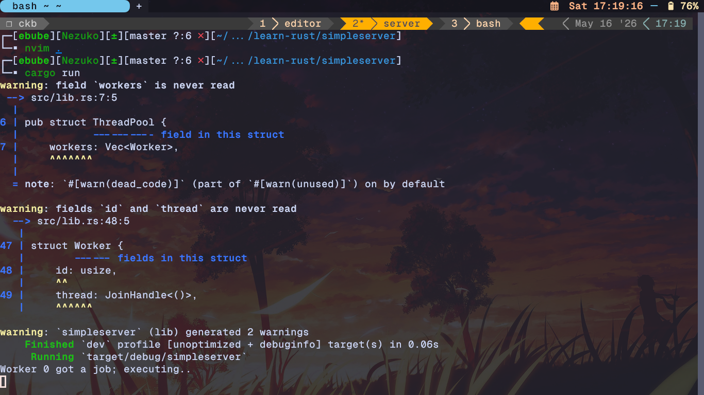
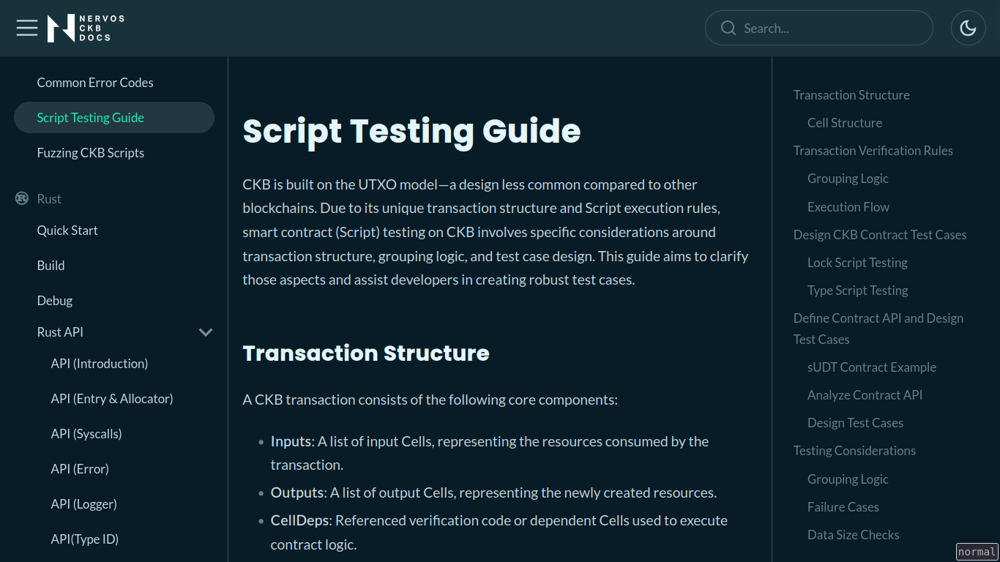

# CKB Builder Track Weekly Report - Week 3

Name: Ebube Ugwu
Week Ending: 16-05-2026

## Courses Completed

- Finished final chapter of **The Rust Book** and built a simple multithreaded HTTP Server 
    - Advanced Features
    - Final Project: Building a Multithreaded Web Server

- [Introduction to Scripts on Nervos CKB](https://docs.nervos.org/docs/script/type-id)
    - Inter-Process Communication in Scripts Cont'd
    - Debug Scripts
    - Upgrade Scripts
    - Common Error Codes
    - Script Testing Guide
    - Fuzzing CKB Scripts

- Learn CKB in 45mins by [truthixify](https://github.com/truthixify/learn-ckb-in-45-minutes)
    * **Off-Chain/On-Chain Pattern:** Computation is performed off-chain, while the blockchain handles only verification.
    * **The Since Field:** Enables flexible time-locking based on blocks, epochs, or absolute timestamps.
    * **Dep Groups:** A mechanism to bundle multiple dependencies into one cell for better efficiency.
    * **Witnesses:** Data fields that carry cryptographic proofs and signatures for transaction validation.
    * **Script Groups:** A system that groups identical scripts to prevent redundant execution cycles.
    * [First CKB Script Using Rust](../projects/learn-ckb-in-45-minutes/first-script)

### Screenshots

## Key Learnings

- Learned advanced Rust concepts including unsafe Rust, advanced traits, advanced types, macros, and function pointers.

- Understood how Rust handles concurrency in a practical server project using threads, workers, and shared job execution.

- Deepened understanding of CKB script development through debugging, upgrades, common errors, testing, and fuzzing.

- Reviewed how witnesses, dep groups, script groups, and the `since` field support efficient and flexible CKB transaction validation.

- Practiced the off-chain/on-chain pattern where computation happens off-chain and CKB scripts verify correctness on-chain.

## Practical Progress

- Completed The Rust Book and built a simple multithreaded HTTP server.

- Continued the first CKB script walkthrough using Rust.

- Studied CKB script debugging, testing, upgrade, and fuzzing workflows.

## Environment

- Rust and Cargo environment ready for building CLI tools, servers, and CKB scripts.

- CKB learning workspace set up with documentation, script examples, and project files.

## Extra

- Participated in a CKBuilder virtual meetup on google meets
