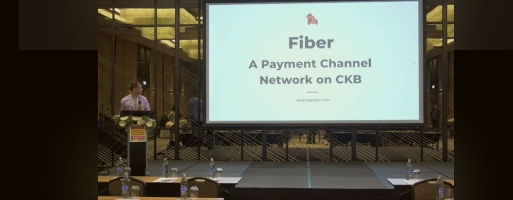
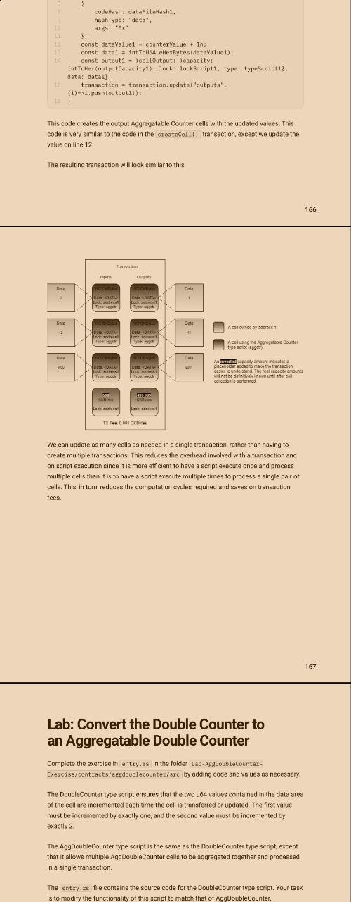

# CKB Builder Track Weekly Report - Week 4
Name: Ebube Ugwu
Week Ending: 23-05-2026

## Courses Completed

 ### L1 Developer Training Course (Nervos CKB)
  *I actually downloaded it as a pdf, so i could study on the go, even without an internet connection*

- Introduction to Nervos Basics
    - Lab Exercise Setup and Dev Chain Configuration
    - Transactions and Transaction Lifecycle
    - Sending and Examining Transactions
    - Inputs, Outputs, and Out Points
 - Introduction to the Cell Model
    - Live Cells and Dead Cells
    - Capacity Requirements and Transaction Fees
    - Introduction to Lumos Framework (*lumos is deprecated so i just read through and practiced using offckb*😁)
    - Working with Transaction Skeletons
    - Cell Collection and Automated Capacity Management
    - Using the Indexer for Cell Queries
    - Storing Data in Cells
    - Transaction Validation and Witnesses
    - Cell Dependencies and Script Dependencies
- Lock Scripts and Type Scripts
    - Working with Scripts and Script Groups
    - CKB-CLI and RPC Interaction
    - Basic On-Chain Data Storage
    - Practical Transaction Building Exercises

### Rust Book Revision (Chapters 19 - 21)
*I didn't fully grasp the concepts covered in these chapters, the first few times i read them so i had to read them some more* 😅

- Advanced Traits & Advanced Types
- Unsafe Rust
- Pattern Matching
- Macros and Metaprogramming

## Screenshots

## Key Learnings

- Developed a stronger understanding of the Nervos CKB transaction model, especially how transactions consume live cells and create new cells while maintaining capacity accounting.

- Learned how transaction components such as inputs, outputs, witnesses, cell deps, and script execution interact to validate state transitions on CKB.

- Understood how out points reference previous cells and how cell ownership and authorization are enforced through lock scripts.

- Practiced working with transaction skeletons, including creating transactions, adding inputs and outputs, signing transactions, and broadcasting them to a local dev chain.

- Learned how automated cell collection works using the Indexer and CellCollector, and how change cells and transaction fees are calculated.

- Studied capacity management in detail, including minimum cell capacity requirements and how on-chain storage directly relates to CKByte ownership.

- Strengthened understanding of advanced Rust concepts such as advanced traits, associated types, fully qualified syntax, dynamically sized types, and macro systems after revisiting Chapters 19 - 21.

- Improved understanding of how CKB scripts are executed through script groups, witnesses, dependencies, and VM execution flow.

- Practical Progress
Completed the L1 Developer Training Course exercises and practiced transaction-building workflows on a local CKB dev chain.

- Built and executed multiple basic transactions using offckb.

- Practiced manually inspecting transactions, out points, live cells, and witnesses using RPC calls and ckb-cli.

- Configured and interacted with a local CKB dev blockchain and indexer environment.

- Worked through exercises involving automated cell collection, transaction fee calculations, and change cell generation.

- Practiced storing and retrieving data from cells and inspecting the resulting on-chain state.

- Re-read Chapters 19 - 21 of the Rust Book to reinforce understanding of advanced Rust concepts that were not fully clear during the first read-through.

## Environment

Rust toolchain and Cargo configured for CKB script development and Rust CLI workflows.

- Local CKB dev chain configured and running for transaction testing and experimentation.

- OffCkb framework and Node.js environment configured for transaction generation and blockchain interaction.

- CKB CLI and Indexer tooling available for transaction inspection, debugging, and cell queries.

## Extra

- Learned about the Fiber Network through videos on the Nervos Network YouTube channel.

- Went through the Fiber Network showcase and explored its role in scaling payments and enabling off-chain transaction routing on Nervos.
