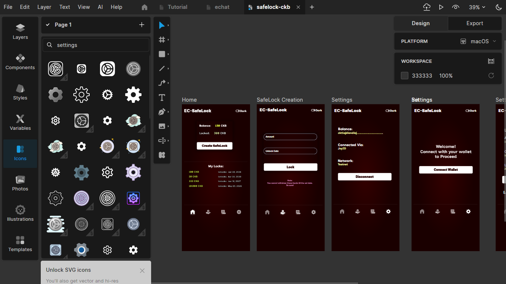
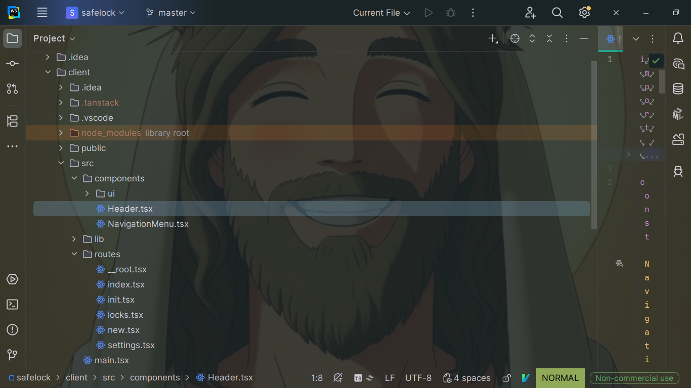
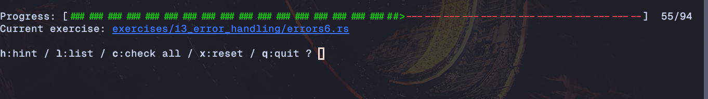

# CKB Builder Track Weekly Report - Week 5

Name: Ebube Ugwu
Week Ending: 30-05-2026

## This week, I decided to create a basic CKB project (Enough theory😅)

## SafeLock

A simple app that let's a user lock ckb funds for a specific duration.

### TechStack

- **UI** Lunacy
- **Client** React + Tanstack Router + Shadcn
- **Rust**

### Current Progress

This week I was able to finish up the designs using [Lunacy](www.lunacyapp.com) (it's like Figma, but free and offline and very linux friendly) and implement over 40% of the frontend. (I am not using any AI assistance, as I make it a priority to not use AI for something that I can't do myself or do not understand, So I had to look up documentation a lot, especially for the UI part, although I have react experience, I primarily work on server-side development using Java, and most Java shops tend to use angular, all in all, I learn't a lot)
### Screenshots

## Rustlings

I also continued my on my Rust path but took a more hands-on approach (like i said, *enough theory!😅*)
I ended up covering over 50% of the rustlings

### Chapters Solved

    ★ 04_primitive_types
    ★ 05_vecs
    ★ 06_move_semantics
    ★ 07_structs
    ★ 08_enums
    ★ 09_strings
    ★ 10_modules
    ★ 11_hashmaps
    ★ 12_options
    ★ 13_error_handling

### Rust Book Revision

I also revised chapters for the exercises I struggled with

- Modules
- Error Handling
- Strings and Hashmaps
- Smart Pointers

### Screenshot

## Key Learnings

- Developed an understanding of core Tanstack Router concepts

- Deepened Knowledge of Rust fundamentals and move semantics

- Practiced State management via React Provider

## Environment

Rust toolchain and Cargo configured for CKB script development and Rust CLI workflows.

- Local CKB dev chain configured and running for transaction testing and experimentation.

- OffCkb framework and Node.js environment configured for transaction generation and blockchain interaction.

- CKB CLI and Indexer tooling available for transaction inspection, debugging, and cell queries.

- SafeLock Project in progress **42%..**

## Extra

- Learnt about Shadcn, it's pretty popular for frontend web3 client applications.
