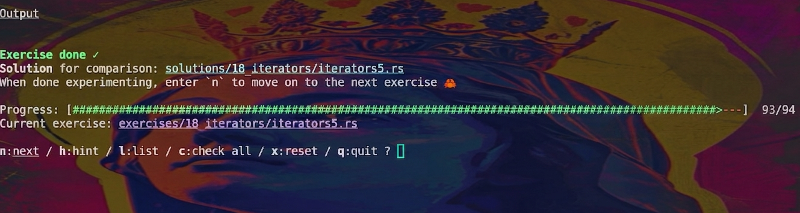
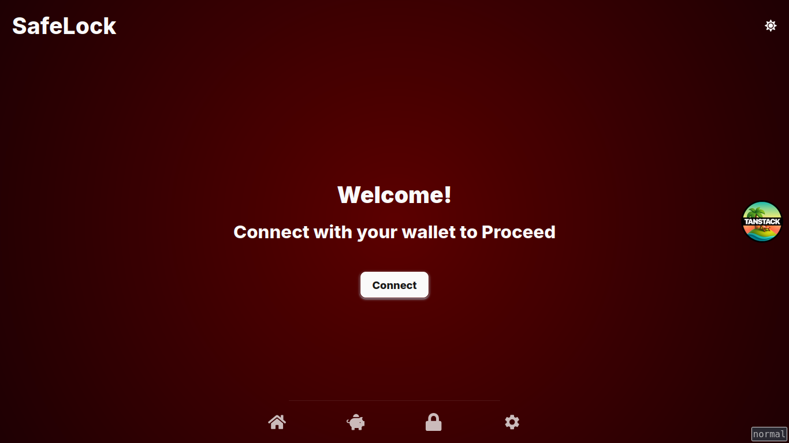
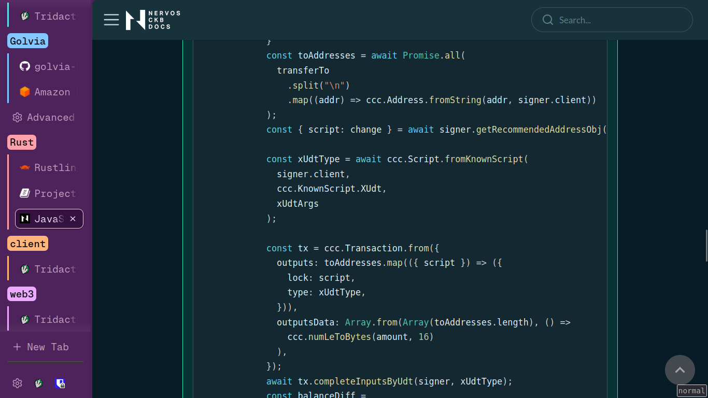
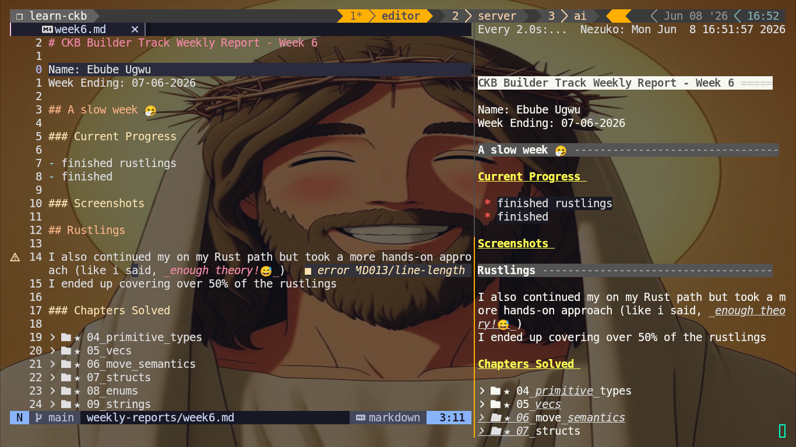

# CKB Builder Track Weekly Report - Week 6

Name: Ebube Ugwu
Week Ending: 07-06-2026

## A slow week 🤧

### Current Progress

- Finished Rustlings.
- Finished the [Command Line Applications in Rust tutorial](https://rust-cli.github.io/book/tutorial/setup.html).
- Finished the SafeLock client with TanStack/React and the core frontend functionality.
- Read through the CKB [Rust SDK docs](https://docs.nervos.org/docs/sdk-and-devtool/rust) and JavaScript CCC docs.

### Screenshots

## Rustlings

I finished all Rustlings exercises. The last ones were pretty tough 🫠

### Chapters Solved

    ★ 14_generics
    ★ 15_traits
    ★ 16_lifetimes
    ★ 17_tests
    ★ 18_iterators
    ★ 19_smart_pointers
    ★ 20_threads
    ★ 21_macros
    ★ 22_clippy
    ★ 23_conversions

### Rust Book Revision

I also revised chapters for the exercises I struggled with

- Iterators and Closures
- collect()
- Lifetimes
- Smart Pointers
- Threads

## Key Learnings

- Practiced advanced Rust concepts from the final Rustlings chapters, especially threads, smart pointers, macros, Clippy fixes, and type conversions.

- Learned how CKB smart contracts behave as validators: they do not store global contract state directly, they validate whether a transaction is allowed to consume and create cells.

- Improved my understanding of using Rust with CKB scripting and how scripts verify cell data, witnesses, and transaction structure during execution.

## Pending

- Push SafeLock to testnet for end-to-end testing.

- Refactor the SafeLock core layer before final testing.

## Environment

- Rust toolchain and Cargo configured for CKB script development and Rust CLI workflows.

- Local CKB dev chain configured and running for transaction testing and experimentation.

- OffCkb framework and Node.js environment configured for transaction generation and blockchain interaction.

- CKB CLI and Indexer tooling available for transaction inspection, debugging, and cell queries.

- SafeLock project in progress **90%**.

## Extra

- Reconfigured my development environment for a faster terminal-driven workflow.

