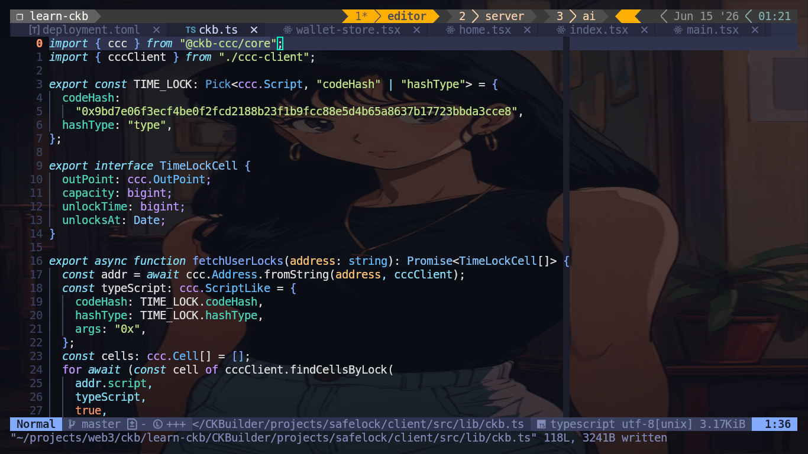
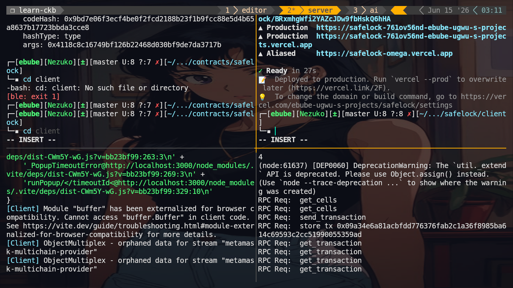
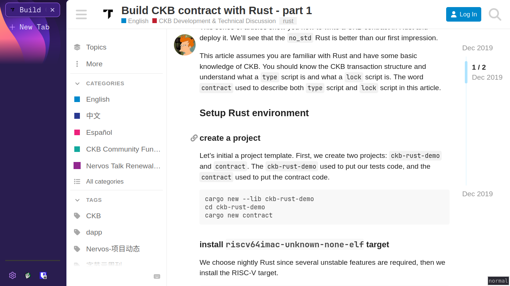
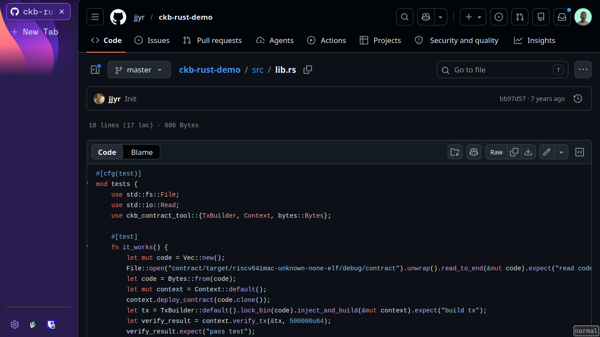
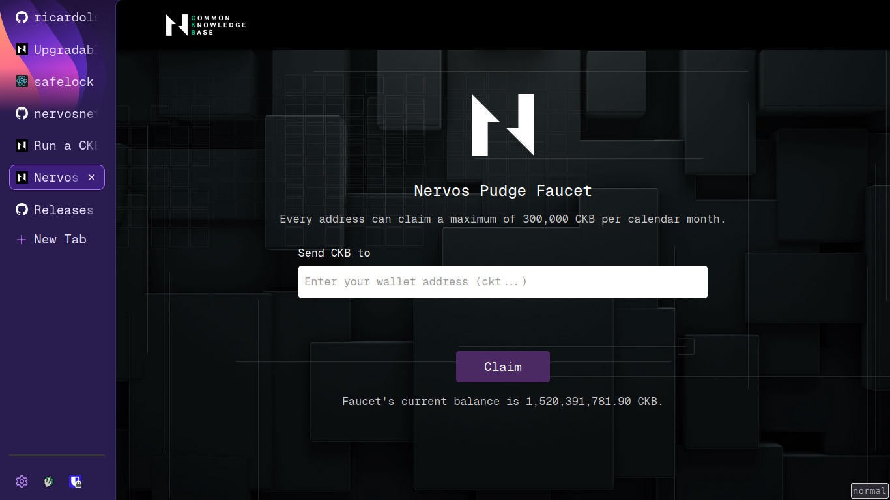
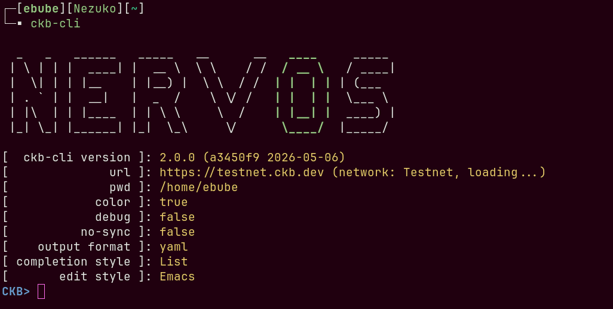

# CKB Builder Track Weekly Report - Week 7

Name: Ebube Ugwu
Week Ending: 14-06-2026

## *Not as easy as it looked 🗺️*

### Current Progress

- Refactored the Safelock dapp to utilize offckb and cargo-generate
- Learnt the basics of ckb-cli
- Revised through the CKB (Majorly on Scripting) [Rust SDK docs](https://docs.nervos.org/docs/) and JavaScript CCC docs.

## SafeLock

The first safelock contract I made utilized the old Capsule framework, since most comprehensive tutorials I found used Capsule or Lumos. I wanted to migrate it to use the new approach with offckb and script templates generated via cargo-generate. I was able to accomplish this successfully.

## Testnet

I had initially hoped to submit my report with a link to the safelock project hosted publicly, but deploying to testnet proved difficult — I couldn't find a detailed guide. This led me to rethink future reports. Rather than immediately starting on the fundraiser dapp, I decided to make week 8 focus on writing a guide for developing the safelock dapp all the way to testnet deployment. I believe a hand-held guide from A to Z will prove useful for future devs in the space.

Although I was unable to deploy on my own during the week, it led to discovering new tools like the CKB node tool, ckb-cli, and old posts by core Nervos contributors like **Jjyr**. I also learned about the Pudge faucet for funding testnet wallets and some nerdy details I had missed before.

## Key Learnings

- Migrated a CKB contract from the deprecated Capsule framework to the modern offckb + cargo-generate workflow.
- Learned the basics of ckb-cli for transaction inspection, cell queries, and local node interaction.
- Understood practical testnet deployment challenges and the infrastructure needed (CKB node, Pudge faucet, key management).
- Gained insights from core contributors (Jjyr) on CKB Rust development patterns and best practices.

## Pending

- Push SafeLock to testnet for end-to-end testing.
- Make a full post/guide on building safelock for future devs.

## Environment

- Rust toolchain and Cargo configured for CKB script development and Rust CLI workflows.
- Local CKB dev chain configured and running for transaction testing and experimentation.
- OffCkb framework and Node.js environment configured for transaction generation and blockchain interaction.
- CKB CLI and CKB tooling available for transaction inspection, debugging, and cell queries.

## Extra

- Read through a ton of Nervos-Talk posts

## Week 8

- Expect a walkthrough on how the tutorial post for safelock was made, and all the things I learned in trying to teach others.