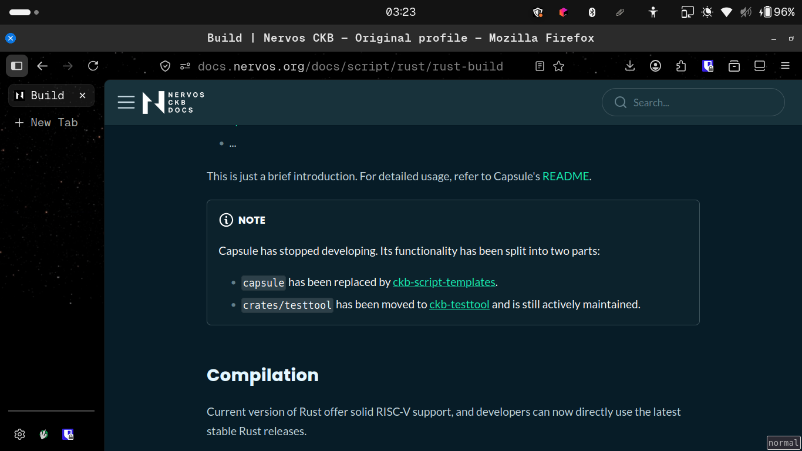
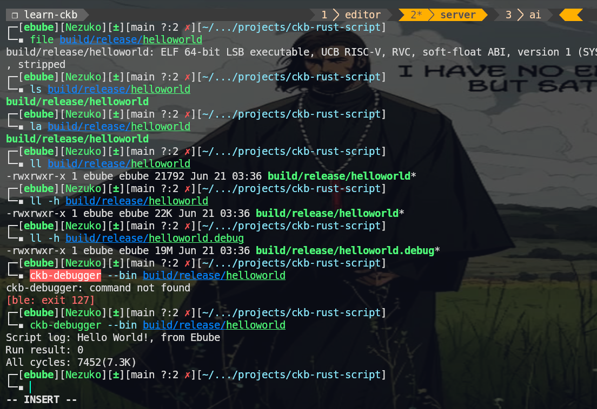
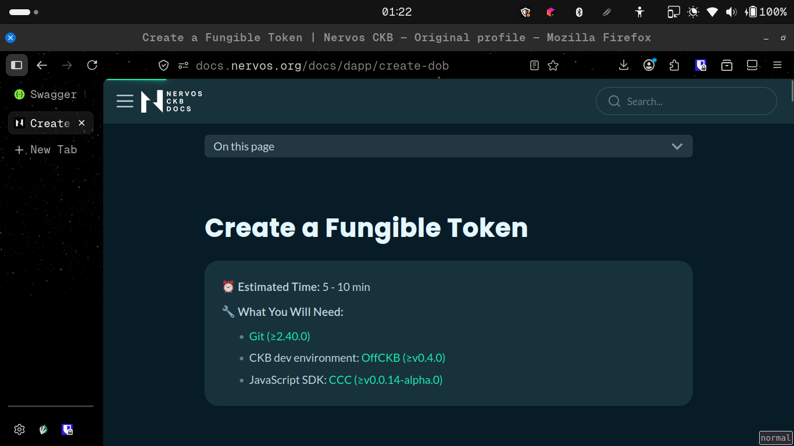
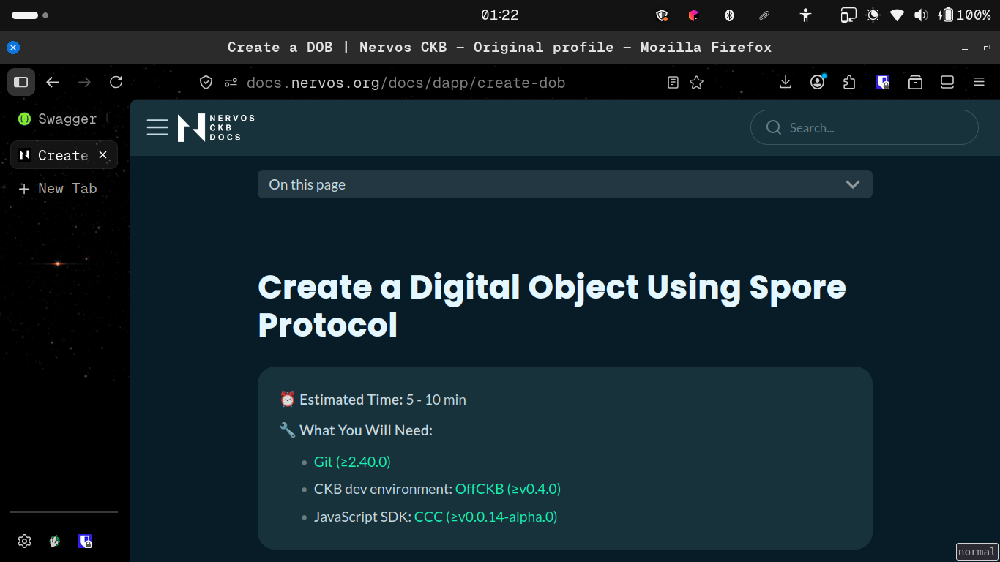
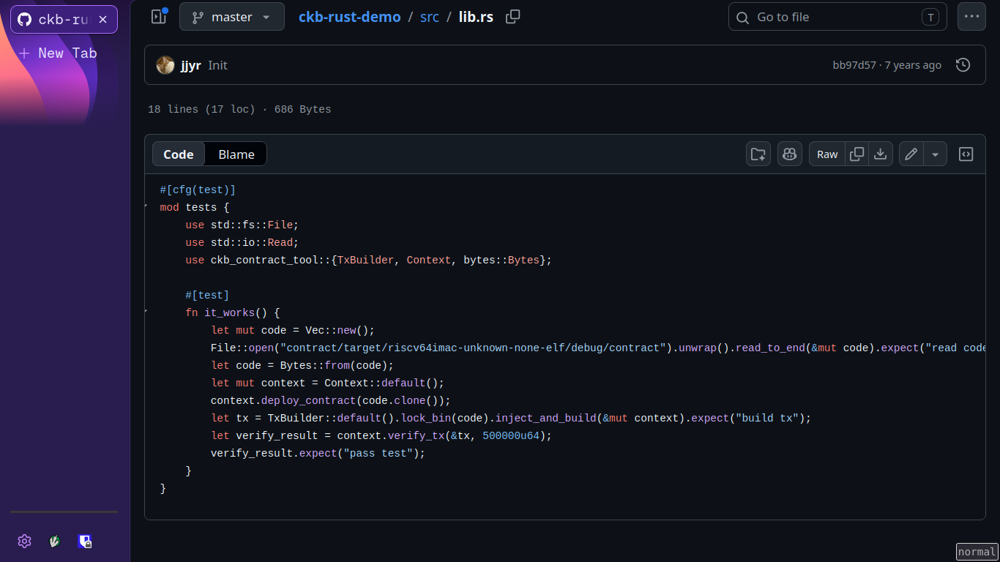
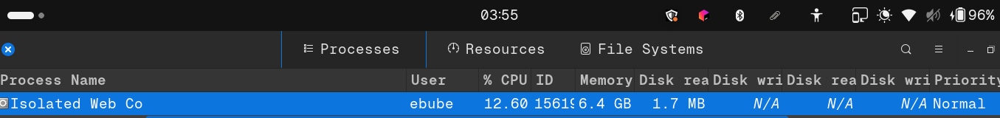

# CKB Builder Track Weekly Report - Week 8

Name: Ebube Ugwu
Week Ending: 21-06-2026

## _Don't Skip the Docs!_

## Creating a fungible token

Learnt how user defined tokens take advantage of CKB's UTXO-cell like model and extend from the system script xUDT (extensible user defined token) and how the xUDT-Args functions as the unique id for each user defined token on CKB.

To get the amount of a UDT in circulation you simply calculate the capacity of all the live cells whose type script matches the type script of the UDT (constructed from the xUDT-Args). Likewise, to transfer your UDT you simply create a new cell and change the lock script from yours (the issuer) to the lock script of the receiver (so they can spend the cell and give your token to others).

### Question: Where do the gas fees get deducted from?

Since it is a custom token, I began to wonder where exactly the gas fees will get deducted from:

- Will it be similar to Ethereum, where the holder must have some ETH in the same wallet to pay for it, or the dApp pays for it?
- Or more like Solana, where the sender must always have some SOL to pay for gas fees?

In CKB it is more similar to Solana — the user must have some CKB in the same wallet to pay for both gas fees and the creation of the cell that will hold the tokens for the receiver. (When sending native CKB, the CKB required for the receiver's output cell creation is taken from the amount you are sending them, hence why the minimum CKB you can send is 63 CKB.)

## Creating a Digital Object using the Spore Protocol

Learnt how to create a digital object on CKB using the Spore Protocol, which defines a standard for on-chain digital objects (DOBs). The process involves constructing a Spore DOB cell whose type script references the Spore cluster/DOB type, then serializing the content (e.g. image metadata, text) and cluster info into the cell's data field using molecule serialization. The Spore Protocol ensures interoperability across wallets and dApps by standardizing how DOBs are created, transferred, and rendered on CKB.

## Refresher Course on Smart Contracts with CKB via Nervos Docs

Reviewed the evolution of CKB contract development — Capsule has been replaced by ckb-script-templates (via cargo-generate) as the recommended scaffolding approach. There are three main ways to run contracts:

1. **Deployment + JS SDK**: Compile to RISC-V and deploy to a node, then interact via offckb or CCC.
2. **ckb-debugger**: Run locally; to simulate real on-chain conditions you must pass transaction data via the `--tx-file` (`-f`) flag.
3. **ckb-testtool**: Simulates real-world conditions by default, closely mirroring the actual CKB node environment.

The main advantage of ckb-testtool is that the environment closely resembles that of the actual CKB node, and thus the Nervos network itself. Unlike a standalone binary, ckb-testtool is a library you add as a dev-dependency and invoke via Rust `#[test]` functions — making it seamless to integrate into existing test suites. In my guide I plan to highlight this library-not-binary distinction, show how to add it to `Cargo.toml`, and walk through writing a basic integration test from scratch.

## Deployment to Testnet

Finally understood how to properly use offckb and deployed to testnet.
Check it out on Vercel (p.s. the UI is still rough): [Safelock](https://safelock-omega.vercel.app/)

## Tutorial on SafeLock

I decided to split it up into two phases:

  - [Phase 1: Core Rust Smart Contract tutorial (from scratch to deployment)](../tutorials/safelock-1.md)
  - Phase 2: Integration with a React Frontend (via CCC) and Non-custodial Wallet (JoyId)

## Key Learnings

- Understood how xUDT works on CKB — type scripts as token identifiers, circulation calculated from live cell queries, and transfers as lock-script reassignments.
- Learned how CKB's fee model compares to Ethereum and Solana: users must have CKB in the same wallet for both gas and cell creation.
- Practiced creating and serializing digital objects on-chain using the Spore Protocol.
- Reviewed the modern CKB contract development workflow (ckb-script-templates, ckb-debugger, ckb-testtool) and how it replaces the deprecated Capsule framework.
- Successfully deployed a contract to testnet using offckb and documented the process.

## Environment

- Rust toolchain with `riscv64imac-unknown-none-elf` target for CKB contract compilation.
- CKB devnet via offckb for local testing.
- ckb-testtool for integration-level contract tests.
- JoyID wallet + CCC SDK for client-side CKB interactions.
- Vercel deployment for the SafeLock UI.

## Screenshots

## Extra

Read 10 posts on Nervos Talks, mainly those by [Truthixify](https://talk.nervos.org/u/truthixify/summary)

## Week 9

    - Grow my knowledge on CKB smart contracts via the numerous posts on Nervos Talks and the Nervos documentation.

- Complete Phase 2 of the SafeLock tutorial (React frontend + CCC + JoyID).
- Investigate Nervos Docs issues related to lag and RAM consumption.
- Begin implementation of the Fundraiser project.
- For some reasons the Nervos Docs website gets slow overtime and eats massive amounts of RAM
