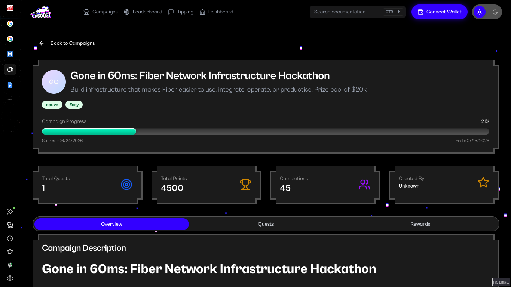
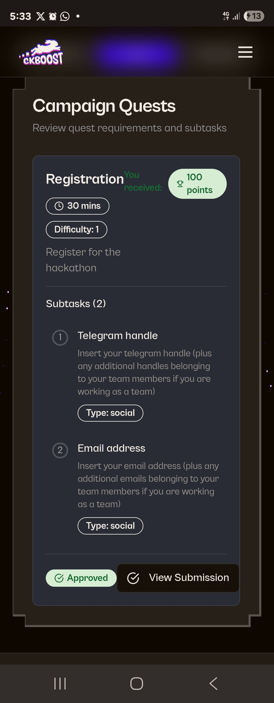
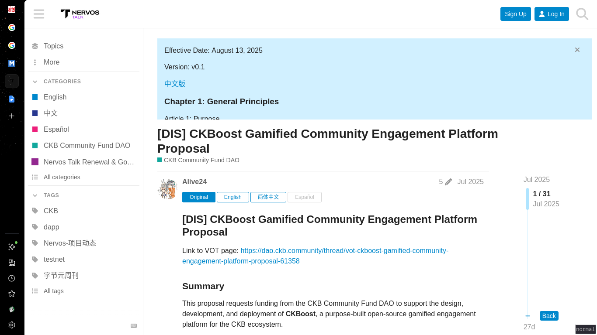

# CKB Builder Track Weekly Report - Week 9

Name: Ebube Ugwu
Week Ending: 28-06-2026

## _Hack my plans away_

## Fiber Network Infrastructure Hackathon

Due to the incoming Fiber Network Hackathon, I decided to scrap my previous plans and go all-in on preparing. I had been making solid progress on CKB smart contracts and planned to focus on Java developer onboarding tooling, but the hackathon was too good to pass up. I centered this week on learning everything I could about Fiber Network and brainstorming project ideas. The hackathon kicks off July 1st.

## 6-Day Fiber Sprint

### Payment Channels & Lightning Fundamentals

Started with the Bitcoin Lightning Network basics: payment channels, HTLCs, channel lifecycle, multi-hop routing, watchtowers, and liquidity management. Worked through the first few chapters of _Mastering the Lightning Network_ and the Fiber Light Paper.

Key takeaway: off-chain channels let you do unlimited transactions between two parties with only two on-chain transactions (open + close). HTLCs enable trustless routing across multiple hops — without them, you'd need to trust every intermediary. Watchtowers exist because you can't be online 24/7 to watch for channel closures.

### Fiber Architecture

Deep dive into the Fiber Light Paper. Fiber is CKB's payment channel network — it uses Daric (a modified version of the Lightning protocol adapted for CKB's cell model) and has a PTLC (Point Time Locked Contract) roadmap for greater privacy. Key components:

- **Fiber Nodes**: Each runs the Fiber protocol, manages channels, and participates in routing.
- **Channel Lifecycle**: Opening (funding transaction), updating (HTLCs for payments), closing (cooperative or force close).
- **Contracts**: CKB scripts enforce channel rules — no need for a separate fraud proof mechanism since CKB's cell model handles state natively.
- **Watchtower**: Monitors the chain for fraudulent closes on your behalf.
- **Cross-chain Hub**: Fiber connects CKB to Bitcoin and other chains via RGB++, enabling multi-asset channels and stablecoin payments.

### Read the Code

Cloned the [Fiber repository](https://github.com/nervosnetwork/fiber) and studied the codebase architecture:

- **`node/`**: Core node implementation — channel state machine, peer management, event loop.
- **`routing/`**: Pathfinding using a modified Dijkstra algorithm over the channel graph. Channels are stored as a weighted graph in memory, with edge weights based on fees and liquidity.
- **`network/`**: P2P layer — gossip protocol for channel announcements, peer discovery, and network sync.
- **`payment/`**: Payment lifecycle — from HTLC construction to forwarding to settlement.
- **`channel/`**: Channel state machine — tracks funding, balance, and closure states. Channels are stored in a RocksDB database keyed by channel ID.

Messages are encoded using molecule serialization (same as CKB core). RPC is provided via a JSON-RPC interface for external tooling.

### Build & Run Fiber

Set up a local Fiber development environment:

- Ran two Fiber nodes on the local devnet (via offckb).
- Opened a channel between them — the funding transaction creates a CKB cell with the channel state.
- Sent a payment across the channel and inspected the logs to see HTLC propagation and settlement.
- Observed state transitions: the channel goes through `Initial -> Negotiating -> Operational -> Closing -> Closed`.

CLI commands like `fiber-cli channel open`, `fiber-cli payment send`, and `fiber-cli channel list` made the workflow surprisingly smooth. The RPC endpoints mirror these commands, making it easy to integrate into applications.

### Existing Ecosystem

Studied community projects from the [Fiber Showcase](https://fiber.world):

- **Fiber Dashboard**: Real-time channel graph visualization and network stats. Great for network health monitoring but lacks per-channel analytics.
- **Audio Micropayments**: Pay-per-second audio streaming over Fiber channels. Clever proof-of-concept but limited to a single use case.
- **Fiber Link**: A JS library for integrating Fiber payments into web apps. Good foundation but documentation is sparse.

Common gaps across projects: poor developer onboarding, limited SDK support (Rust-only for now), no merchant checkout primitives, and no liquidity management tooling.

### Hackathon Planning

Brainstormed project ideas aligned with the hackathon categories:

| Idea                              | Problem                                                                  | Category           |
| --------------------------------- | ------------------------------------------------------------------------ | ------------------ |
| **Routing Diagnostics Dashboard** | No visibility into channel health, routing failures, or fee optimization | Routing/Node       |
| **Fiber Java/Spring Boot SDK**    | No SDK for the massive Java/Spring ecosystem                             | Dev Tooling        |
| **Merchant Checkout SDK**         | No plug-and-play payment primitives for merchants                        | Merchant/Liquidity |
| **Liquidity Monitor**             | No tooling to track channel liquidity, rebalancing needs                 | Liquidity          |
| **Payment Simulator**             | No sandbox for testing payment flows before going live                   | Dev Tooling        |

## Hackathon Progress

- Registered Successfully ☑️

- Background Fiber network study completed ☑️
- Brainstormed 5 project ideas, narrowed to top 2 ☑️

## Key Learnings

- Payment channels enable unlimited off-chain transactions with only two on-chain operations (open/close) — HTLCs make multi-hop routing trustless.
- Fiber adapts Lightning to CKB's cell model via Daric, with a PTLC roadmap for privacy and RGB++ for cross-chain asset support.
- CKB's native cell model eliminates the need for fraud proofs — channel state is enforced by CKB scripts at the consensus level.
- Channel state is stored in RocksDB, the routing layer uses a weighted graph (Dijkstra), and messages are molecule-serialized — just like CKB core.
- The existing Fiber ecosystem is still young: basic dashboards and proof-of-concepts exist, but production-grade merchant tooling, SDKs, and diagnostics are wide open for the hackathon.
- Running a local Fiber network is straightforward with offckb + fiber-cli — useful for rapid prototyping.

## Reference Links

- [Fiber Official Site](https://fiber.world)
- [Fiber Light Paper](https://github.com/nervosnetwork/fiber/blob/develop/docs/light-paper.md)
- [Fiber GitHub Repository](https://github.com/nervosnetwork/fiber)
- [Fiber Technical Article (Cryptape)](https://blog.cryptape.com/fiber-a-payment-channel-network-on-ckb)
- [Mastering the Lightning Network (free book)](https://github.com/lnbook/lnbook)
- [Fiber Showcase (Community Projects)](https://fiber.world)

## Extra

Read more Nervos Talk posts and discovered the Ckboost Platform was built through Community DAO funding — found the original proposal thread.

## Week 10

- Hackathon begins July 1st 🚀
- Finalize and submit project — leaning toward the Routing Diagnostics Dashboard and/or the Java/Spring Boot Fiber SDK
- Build the MVP within the 2-week submission window
